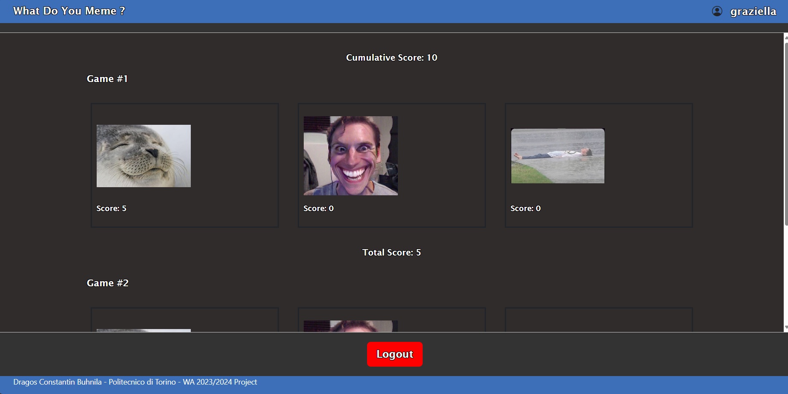

[](https://classroom.github.com/a/AVMm0VzU)
# Exam #N: "Exam Title"
## Student: s123456 LASTNAME FIRSTNAME 

## React Client Application Routes

- Route `/`: redirects to `/home`
- Route `/*`: redirects to `/home`
- Route `/home`: homepage, from which you can start a game or visit the login/profile page
- Route `/login`: login page
- Route `/profile`: page at which you can see your history or log out
- Route `/play`: actual gameplay page
- Route `/gameover`: gameplay end page. Here you can (if you're logged in) press a button to save your game.


## Main React Components

- `Header` (in `header.jsx` and `header_gohome.jsx`): the same header is displayed in all pages. It shows the app name (onclick redirects to home) and a profile/login section (onclick redirects to profile/login). In certain pages the click on the profile/login is overridden to redirect to home, by importing `header_gohome.jsx` instead of `header.jsx`.
- `Footer` (in `footer.jsx`): the same footer is displayed in all pages. It shows a copyright signature.
- `Login`  (in `login.jsx`): simple login component. It displays error messages to help the user.
- `Profile` (in `profile.jsx`): profile page. It contains a box with a game from history for each row. It also contains a logout button on the bottom.
- `Home` (in `home.jsx`): the home.
- `Play` (in `play.jsx`): the gameplay section. Contains an image for each of the three rounds, with a timer and score on its left and right respectively. The round timer is substituted with a NextRound or GameOver timer (faster), at the end of the round or the game.
- `Captions` (in `play.jsx`): the captions container. Of the 7 captions, if an answer was incorrect, that will be highlighted in red, and the correct ones in green, while if the answer was correct, only the selected answer will be highlighted in green.
- `GameOver` (in `gameOver.jsx`): the game end page. It shows the three chosen memes with the chosen captions (the text will be empty for timeout answers), coloring them with green or red based on the guess.


## API Server

### Session API
- POST `/api/sessions/`: perform login
  - Request Parameters: None
  - Request Body Content: None
  - Response Body Content: A string with the username:
    - Example: ```graziella```
  - Acess Constraints: None
  - Response Status Codes and Possible Errors:
    - ``` 401 ``` Wrong Credentials
    - ``` 500 ``` Internal Server Error
- GET `/api/sessions/current`: get username of the currently logged in user
  - Request Parameters: None
  - Request Body Content: None
  - Response Body Content: None
  - Acess Constraints: 
  - Response Status Codes and Possible Errors:
    - ``` 401 ``` Unauthenticated
    - There may be generic errors
- DELETE `/api/sessions/current`: perform logout
  - Request Parameters: None
  - Request Body Content: None
  - Response Body Content: None
  - Acess Constraints: Can only be called by a Logged-In User
  - Response Status Codes and Possible Errors:
    - There may be generic errors
  
### Game API
- GET `/api/games/new`: fetch 3 random memes and captions (2 valid and 5 invalid ones for each meme)
  - Request Parameters: None
  - Request Body Content: None 
  - Response Body Content: A *Game* object that contains the 3 meme uris and 21 captions of the game
    - Example: ```{
                    meme1: "boii", meme2: "steve_harvey", meme3: "creep",
                    captions1: [Caption{"When you...", true}, Caption{"When you...", false}, Caption{"When you...", true}, ...7 times],
                    captions2: [Caption{"When you...", true}, Caption{"When you...", false}, Caption{"When you...", true}, ...7 times],
                    captions3: [Caption{"When you...", true}, Caption{"When you...", false}, Caption{"When you...", true}, ...7 times]
                  }```
  - Acess Constraints: None
  - Response Status Codes and Possible Errors
    - ``` 500 ``` Internal Server Error
- GET `/api/games/history`: fetch history of the current user
  - Request Parameters: None
  - Request Body Content: None
  - Response Body Content: An array of CompleteGame objects that represents their completed games
    - Example: ```[{
                    meme1: "boii", meme2: "steve_harvey", meme3: "creep",
                    score1: 5, score2: 0, score3: 5, totalscore: 10
                  }]```
  - Acess Constraints: Can only be called by a Logged-In User
  - Response Status Codes and Possible Errors
    - ``` 401 ``` Unauthenticated
    - ``` 500 ``` Internal Server Error
- POST `/api/games/history`: add the current game to the current user's history
  - Request Parameters: None
  - Request Body Content: An object like CompleteGame:
    - Example: ```{
                    meme1: "boii", meme2: "steve_harvey", meme3: "creep",
                    score1: 5, score2: 0, score3: 5, totalscore: 10
                  }```
  - Response Body Content: None
  - Acess Constraints: Can only be called by a Logged-In User
  - Response Status Codes and Possible Errors:
    - ``` 422 ``` Body Format Errors
    - ``` 401 ``` Unauthenticated
    - ``` 500 ``` Internal Server Error
- GET `/api/games/historical-score`: fetch history of the current user
  - Request Parameters: None
  - Request Body Content: None
  - Response Body Content: An object with the following parameters:
    - ```score```: a non-negative integer
    - Example: ```{score: 55}```
  - Acess Constraints: Can only be called by a Logged-In User
  - Response Status Codes and Possible Errors:
    - ``` 401 ``` Unauthenticated
    - ``` 500 ``` Internal Server Error
  

## Database Tables

- Table `users` - Contains information about users, such as username, password, and salt for the password
- Table `memes` - Contains the unique meme name
- Table `captions` - Contains the captions for the memes as text, identified by a unique ID
- Table `history` - Contains all the valid played games, where valid means game completed and user registered. Identified by a unique ID, and stores the username of the user that has played, the meme list as a JSON.stringified array, the associated scores as a JSON.stringified array, and a total score for the game.
- Table `meme_has_caption` - Contains pairs of MemeName and CaptionID, in order to store which pairings are eligible for 5 points.


## Screenshots

Home - Not Logged In


Home - Logged In


Login - Clean


Login - Client Error


Login - Server Error


Profile



Gameplay - Pre Choice


Gameplay - Correct Choice


Gameplay - Wrong Choice


Gameplay - No Choice Timeout


GameOver - Logged In


GameOver - Logged In Game Saved


GameOver - Not Logged In


## Users Credentials

- gianluca, gianluca
- graziella, graziella
